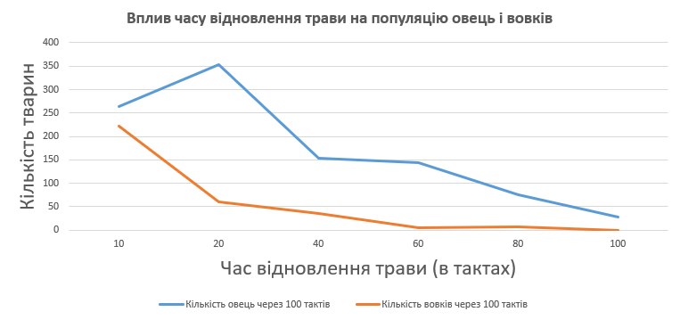

## Комп'ютерні системи імітаційного моделювання

## СПм-23-5, **Жук Максим Володимирович**

### Лабораторна робота №**1**. Опис імітаційних моделей та проведення обчислювальних експериментів

 

### Варіант 7, модель у середовищі NetLogo:

[Wolf Sheep Predation](https://www.netlogoweb.org/launch#http://www.netlogoweb.org/assets/modelslib/Sample%20Models/Biology/Wolf%20Sheep%20Predation.nlogo)

 

### Вербальний опис моделі:

Модель симулює взаємодію між вовками, які є хижаками, і овцями, які є їх жертвами. Вовки полюють на овець для їжі, а кількість овець впливає на популяцію вовків. Модель демонструє динаміку популяцій обох видів, показуючи, як їх чисельність змінюється в залежності від екологічних умов.

### Керуючі параметри:

- **initial-number-sheep**. Початкова кількість овець.
- **initial-number-wolves**. Початкова кількість вовків.
- **grass-regrowth-time**. Час, за який відновлюється трава.
- **sheep-gain-from-food**. Кількість енергії, яку отримують вівці від їжі.
- **wolf-gain-from-food**. Кількість енергії, яку отримують вовки від їжі.
- **sheep-reproduce**. Ймовірність розмноження овець.
- **wolf-reproduce**. Ймовірність розмноження вовків.
- **show-energy**. Логічна змінна, яка визначає, чи слід показувати енергію вовків та овець на екрані.

### Внутрішні параметри:

- **energy**. Енергія, яка є у вовків і овець. Вона може змінюватися в залежності від дій (рух, поїдання, розмноження).
- **countdown**. Використовується в моделі з травою для відстеження часу до відновлення трави на коричневих ділянках.

### Показники роботи системи:

- Eнергія найбільш активної в даний момент овець у популяції, що вказує на їхній рівень здоров'я та здатність до відтворення.
- Eнергія найслабшої овець, яка вказує на ризик її загибелі через голод.
- Енергія найбільш активного вовка, що відображає його здатність до полювання та виживання.
- Енергія найслабшого вовка, що сигналізує про можливу загибель від голоду.
- Показник середнього рівня енергії всіх овець, що відображає їхній загальний стан.
- Показник середнього рівня енергії всіх вовків, що відображає їхній загальний стан.
- Кількість зелених ділянок на полі, що демонструє наявність їжі для овець.
- Загальна кількість загиблих овець і вовків, що свідчить про екологічний баланс у моделі.

### Примітки:

У моделі є опція відображення енергії тварин, що дозволяє користувачеві спостерігати за змінами енергії в реальному часі. Модель передбачає можливість відображення енергетичних рівнів тварин, що забезпечує користувачеві можливість здійснювати спостереження за коливаннями енергії в реальному часі. На початковому етапі спостерігається зростання популяції овець, що відбувається на фоні зниження чисельності вовків. Цей процес, ймовірно, викликаний наявністю великої кількості їжі та відсутністю серйозних хижаків.

Однак у подальшому динаміка популяцій переходить в стадію змішування, де кількість овець поступово стабілізується, тоді як популяція вовків починає збільшуватися. Це свідчить про те, що хижаки адаптуються до середовища, сприяючи зменшенню чисельності жертв. Під тиском зростаючої кількості вовків, популяція овець зазнає суттєвих коливань, в результаті чого спостерігається різкий сплеск чисельності овець, що, ймовірно, пов’язано з певними факторами відновлення середовища.

Надалі, знову відзначається збільшення популяції овець, тоді як кількість вовків помітно зменшується. Цей цикл популяцій демонструє складну динаміку, що відбувається під впливом різноманітних екологічних факторів, які регулюють взаємозв'язок між хижаками та їх жертвами.

### Недоліки моделі:

Модель не враховує складніші аспекти екосистем, такі як зміни в середовищі або взаємодії між популяціями. Вона також може не точно моделювати реальні відносини між вовками та вівцями, оскільки передбачає, що вовки завжди зможуть поїдати вівців.

 

## Обчислювальні експерименти

### 1. Вплив співвідношення овець та вовків на їхню популяцію

Досліджується залежність чисельності овець та вовків протягом певної кількості тактів (100) в залежності від співвідношення овець до вовків на початку симуляції. Експерименти проводяться при різних початкових співвідношеннях.
Інші керуючі параметри мають значення за замовчуванням:

model: sheep-wolves
tacts: 100
grass-regrowth-time: N/A
sheep-gain-from-food: 4
wolf-gain-from-food: 20
sheep-reproduce: 4%
wolf-reproduce: 5%
show-energy: false

<table>
    <thead>
        <tr><th>Співвідношення (вівці: вовки)</th><th>Кількість овець через 100 тактів</th><th>Кількість вовків через 100 тактів</th></tr>
    </thead>
    <tbody>
        <tr><td>5/1</td><td>345</td><td>0</td></tr>
        <tr><td>10/4</td><td>295</td><td>0</td></tr>
        <tr><td>15/8</td><td>700</td><td>0</td></tr>
        <tr><td>20/12</td><td>901</td><td>5</td></tr>
        <tr><td>25/16</td><td>1048</td><td>5</td></tr>
        <tr><td>30/20</td><td>1236</td><td>0</td></tr>
        <tr><td>35/80</td><td>643</td><td>52</td></tr>
        <tr><td>40/200</td><td>300</td><td>1</td></tr>
    </tbody>
</table>

Графік наочно показує, як змінюється динаміка популяцій овець і вовків в залежності від початкового співвідношення.

### 2. Вплив часу відновлення трави на популяцію овець і вовків

Досліджується залежність чисельності овець та вовків протягом певної кількості тактів (100) в залежності від часу відновлення трави. Експерименти проводяться при різних значеннях параметра grass-regrowth-time. Інші керуючі параметри мають значення за замовчуванням:

model: sheep-wolves-grass
initial-number-sheep: 100
initial-number-wolves: 50
sheep-gain-from-food: 4
wolf-gain-from-food: 20
sheep-reproduce: 4%
wolf-reproduce: 5%
show-energy: false

<table>
    <thead>
        <tr><th>Час відновлення трави (в тактах)</th><th>Кількість овець через 100 тактів</th><th>Кількість вовків через 100 тактів</th></tr>
    </thead>
    <tbody>
        <tr><td>10</td><td>264</td><td>222</td></tr>
        <tr><td>20</td><td>353</td><td>61</td></tr>
        <tr><td>40</td><td>154</td><td>36</td></tr>
        <tr><td>60</td><td>145</td><td>5</td></tr>
        <tr><td>80</td><td>75</td><td>8</td></tr>
        <tr><td>100</td><td>29</td><td>0</td></tr>
    </tbody>
</table>

Графік наочно показує, що збільшення часу відновлення трави призводить до зниження кількості овець і вовків, оскільки овець стає менше через обмежений доступ до їжі, що, у свою чергу, впливає на популяцію вовків.

### 3. Вплив енергії, яку отримують вовки від їжі, на виживання вовків

Досліджується залежність чисельності овець та вовків протягом певної кількості тактів (100) в залежності від кількості енергії, яку вовки отримують від їжі. Експерименти проводяться при різних значеннях параметра wolf-gain-from-food. Інші керуючі параметри мають значення за замовчуванням:

model: sheep-wolves-grass
initial-number-sheep: 100
initial-number-wolves: 50
grass-regrowth-time: N/A
sheep-gain-from-food: 4
sheep-reproduce: 4%
wolf-reproduce: 5%
show-energy: false

<table>
    <thead>
        <tr><th>Енергія від їжі для вовків</th><th>Кількість овець через 100 тактів</th><th>Кількість вовків через 100 тактів</th></tr>
    </thead>
    <tbody>
        <tr><td>10</td><td>280</td><td>0</td></tr>
        <tr><td>20</td><td>216</td><td>49</td></tr>
        <tr><td>30</td><td>146</td><td>124</td></tr>
        <tr><td>40</td><td>77</td><td>184</td></tr>
        <tr><td>50</td><td>37</td><td>205</td></tr>
        <tr><td>60</td><td>11</td><td>216</td></tr>
    </tbody>
</table>

Графік наочно показує, що зі збільшенням кількості енергії, яку вовки отримують від їжі, їх популяція значно зростає, оскільки більше вовків здатні виживати і полювати на овець. Це призводить до поступового зменшення кількості овець, оскільки хижаки стають більш ефективними.
