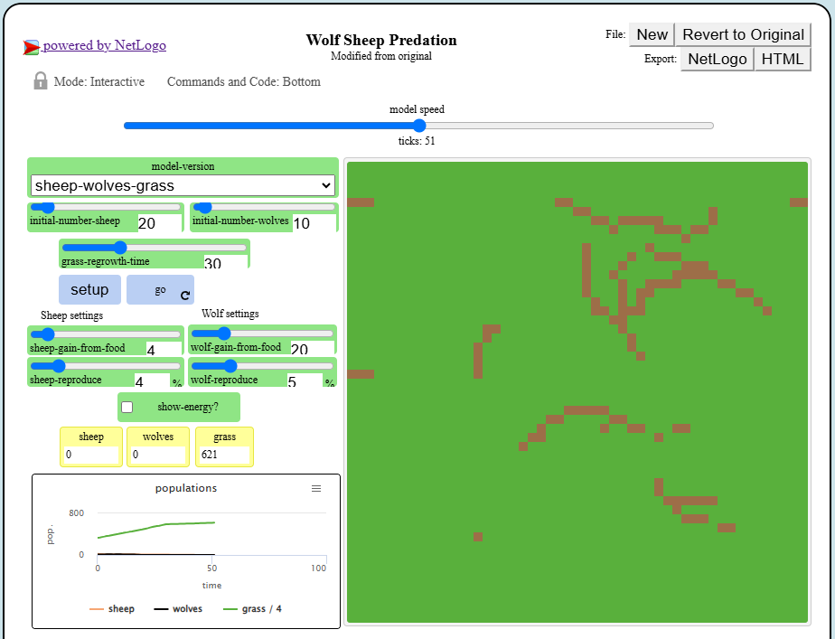
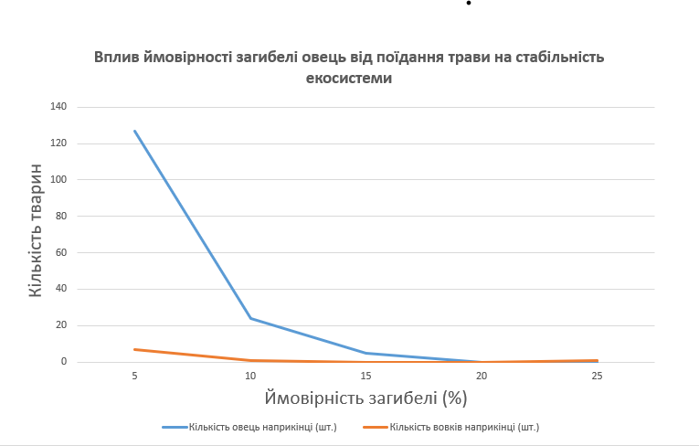

## Комп'ютерні системи імітаційного моделювання

## СПм-23-5, **Жук Максим Володимирович**

### Лабораторна робота №**2**. Редагування імітаційних моделей у середовищі NetLogo

 

### Варіант 7, модель у середовищі NetLogo:

[Wolf Sheep Predation](https://www.netlogoweb.org/launch#http://www.netlogoweb.org/assets/modelslib/Sample%20Models/Biology/Wolf%20Sheep%20Predation.nlogo)

 

### Внесені зміни у вихідну логіку моделі, за варіантом:

**Зміна поведінки вовків для уникнення "зграйності"** — кожен вовк тепер оглядає сусідні клітинки та намагається рухатися до овець і подалі від інших вовків. Якщо поруч немає ані овець, ані вовків, вовк рухається випадково. Додано нову процедуру `hunt-sheep`, яка визначає напрямок руху для кожного вовка:

<pre>
to hunt-sheep  ; wolf procedure
  let sheep-near one-of sheep in-radius 1  ; шукаємо вівцю на сусідній клітинці
  let wolf-near one-of other wolves in-radius 1  ; шукаємо інших вовків
  ifelse sheep-near != nobody and wolf-near = nobody [
    face sheep-near fd 1  ; рухаємось до найближчої вівці
  ]
  [
    if wolf-near = nobody [ rt random 360 fd 1 ]  ; рухаємося випадково, якщо поруч немає вовків чи овець
  ]
end
</pre>

**Усунення надмірної кількості вовків на одній клітинці** — тепер, якщо на одній клітинці перебуває більше одного вовка, залишається тільки один із них, а інші зникають. Додана функція remove-excess-wolves, яка видаляє зайвих вовків на кожній клітинці:

<pre>
to remove-excess-wolves
  ask patches [
    let wolves-here wolves-here
    if count wolves-here > 1 [
      ask n-of (count wolves-here - 1) wolves-here [ die ]
    ]
  ]
end
</pre>

**Зміна поведінки овець для уникнення вовків** — тепер вівці оглядають навколишні клітинки і, якщо знаходять вовка поруч, змінюють напрямок на протилежний. Для цього додана функція avoid-wolves:

<pre>
to avoid-wolves  ; sheep procedure
  let wolf-near one-of wolves in-radius 1  ; шукаємо вовка на сусідній клітинці
  if wolf-near != nobody [
    rt 180 fd 1  ; рухаємось у протилежному напрямку
  ]
end
</pre>

**Додавання виклику нових функцій** у основну процедуру go для забезпечення нового поведінкового циклу кожного агента:

<pre>
ask sheep [
  move
  avoid-wolves  ; виклик функції уникання вовків
  eat-grass
  death
]

ask wolves [
  hunt-sheep  ; виклик функції полювання на овець
  eat-sheep
  death
]

remove-excess-wolves  ; знищення зайвих вовків на кожній клітинці
</pre>

### Внесені зміни у вихідну логіку моделі, на власний розсуд:

**Додана ймовірність смерті для вівці під час поїдання трави**- коли вівця знаходиться на клітинці з травою (зелений колір клітинки), вона спробує її з’їсти. Однак тепер введено ймовірність (10%) того, що вівця може загинути під час поїдання трави. Така ймовірність реалізована через перевірку random-float 100 < 10, що надає 10% шанс на виконання умови. Якщо умова спрацьовує, вівця помирає. Якщо ж вівця виживає, вона споживає траву, змінює колір клітинки на коричневий, щоб показати, що трава з’їдена, і отримує приріст енергії, значення якої визначається параметром sheep-gain-from-food.

<pre>
to eat-grass  ; вівця їсть траву і змінює колір клітинки
  if pcolor = green [
    ; З ймовірністю 10% вівця помирає при поїданні трави
    if random-float 100 < 10 [
      die
    ]
    ; Якщо вівця виживає, вона їсть траву, змінює колір клітинки на коричневий і отримує енергію
    set pcolor brown
    set energy energy + sheep-gain-from-food
  ]
end
</pre>

Фінальний код моделі та її інтерфейс доступні за [посиланням](laba2.nlogo)

## Обчислювальні експерименти

### 1. Вплив ймовірності загибелі овець від поїдання трави на стабільність екосистеми

У цьому експерименті досліджуємо, як імовірність загибелі овець від поїдання трави впливає на стабільність популяції вовків та овець.

**Умови експерименту:**

- Ймовірність загибелі при поїданні трави: 5%, 10%, 15%, 20%, 25%.
- Початкові значення кількості овець: 100.
- Інші параметри, як-от максимальна енергія, швидкість розмноження, залишаються на рівні за замовчуванням.
- Кількість вовків: 20.
- Тривалість симуляції: 50 тактів.

<table>
    <thead>
        <tr><th>Ймовірність загибелі (%)</th><th>Кількість овець наприкінці (шт.)</th><th>Кількість вовків наприкінці (шт.)</th></tr>
    </thead>
    <tbody>
        <tr><td>5</td><td>127</td><td>7</td></tr>
        <tr><td>10</td><td>24</td><td>1</td></tr>
        <tr><td>15</td><td>5</td><td>0</td></tr>
        <tr><td>20</td><td>0</td><td>0</td></tr>
        <tr><td>25</td><td>0</td><td>1</td></tr>
    </tbody>
</table>

Графік наочно показує, що зі збільшенням ймовірності загибелі овець при поїданні трави зменшується загальна кількість овець та вовків наприкінці симуляції.
