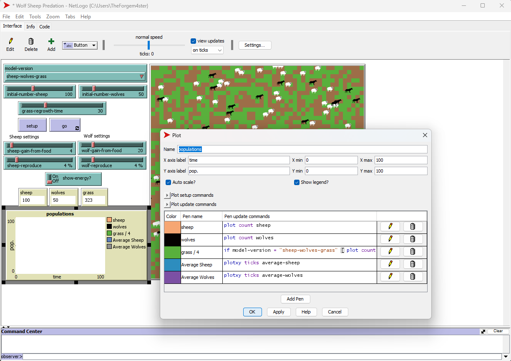
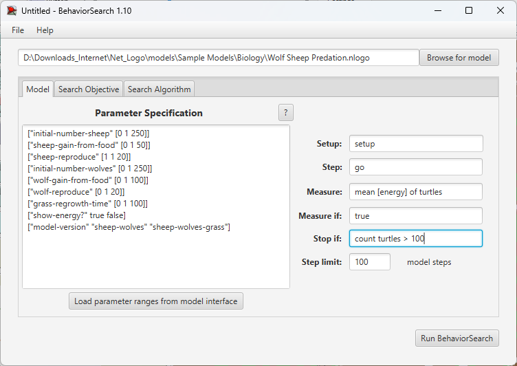
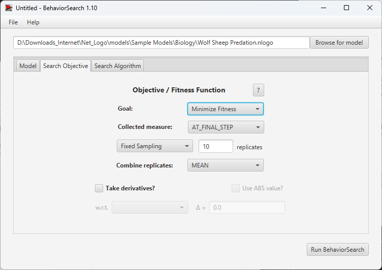
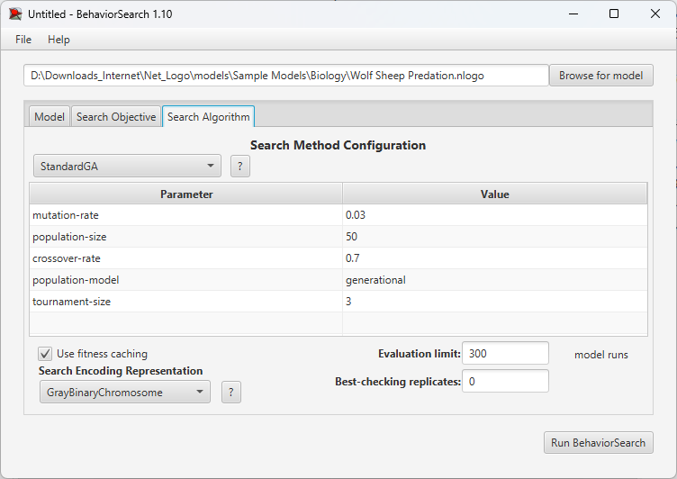
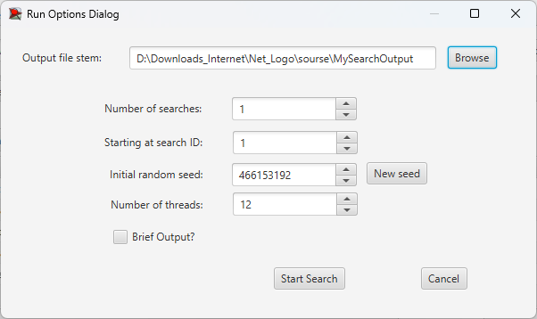
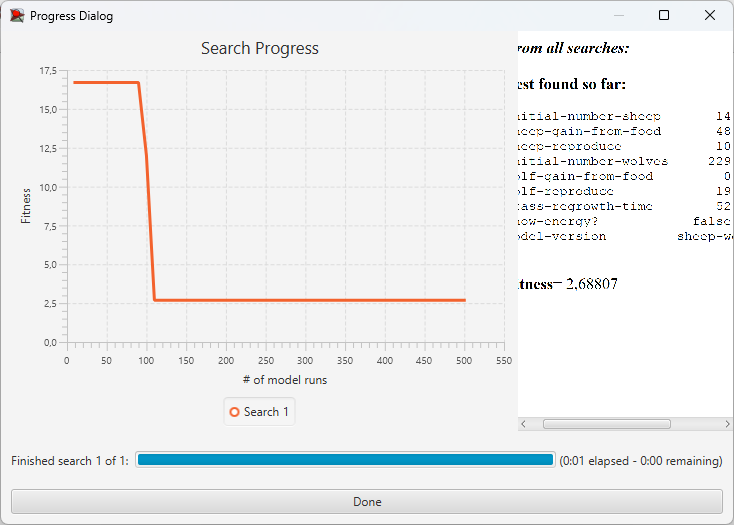
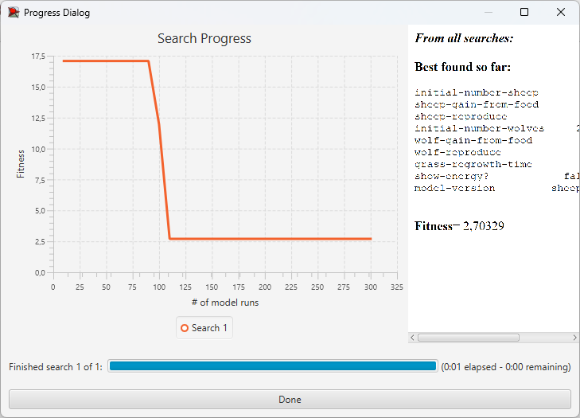

## Комп'ютерні системи імітаційного моделювання

## СПм-23-5, **Жук Максим Володимирович**

### Лабораторна робота №**3**. Використання засобів обчислювального интелекту для оптимізації імітаційних моделей

 

### Варіант 7, модель у середовищі NetLogo:

[Wolf Sheep Predation](https://www.netlogoweb.org/launch#http://www.netlogoweb.org/assets/modelslib/Sample%20Models/Biology/Wolf%20Sheep%20Predation.nlogo)

 

#### Вербальний опис моделі:

Модель Wolf Sheep Predation моделює екосистему, що складається з трьох компонентів: вовків, овець та трави.

- Вівці їдять траву для підтримки енергії.
- Вовки полюють на овець для отримання енергії.
- Трава відновлюється з певною швидкістю після поїдання.

Якщо вівці чи вовки втрачають усю енергію, вони гинуть. Вівці та вовки також можуть розмножуватися, використовуючи певний рівень енергії для цього. Модель демонструє динаміку хижак-жертва та залежність популяцій від екологічних умов.

#### Керуючі параметри:

- **initial-number-sheep** – початкова кількість овець.
- **initial-number-wolves** – початкова кількість вовків.
- **grass-regrowth-time** – час, потрібний для відновлення трави після поїдання.
- **sheep-reproduce** – імовірність розмноження вівці (у відсотках).
- **wolf-reproduce** – імовірність розмноження вовка (у відсотках).
- **sheep-gain-from-food** – кількість енергії, яку отримує вівця від трави.
- **wolf-gain-from-food** – кількість енергії, яку отримує вовк від овець.
- **show-energy** - логічна змінна, яка визначає, чи слід показувати енергію вовків та овець на екрані.

#### Показники роботи модеі:

- Середня кількість вовків за весь час симуляції.
- Середня кількість овець за весь час симуляції.
- Середня кількість трави за весь час симуляції.
- Сталість популяції за останні 100 тактів (відхилення від середнього значення).

### Налаштування середовища BehaviorSearch:

**Обрана модель**:

<pre>
D:\Downloads_Internet\Net_Logo\models\Sample Models\Biology\Wolf Sheep Predation.nlogo
</pre>

**Параметри моделі** (вкладка Model):  
Параметри та їх модливі діапазони були автоматично вилучені середовищем BehaviorSearch із вибраної імітаційної моделі.

<pre>
["initial-number-sheep" [0 1 250]]
["sheep-gain-from-food" [0 1 50]]
["sheep-reproduce" [1 1 20]]
["initial-number-wolves" [0 1 250]]
["wolf-gain-from-food" [0 1 100]]
["wolf-reproduce" [0 1 20]]
["grass-regrowth-time" [0 1 100]]
["show-energy?" true false]
["model-version" "sheep-wolves" "sheep-wolves-grass"]
</pre>

Використовувана міра:
Для оцінки фітнес-функції (цільової функції) моделі було вибрано середній рівень енергії вовків протягом симуляції. Це дозволяє виміряти, як енергія вовків змінюється у залежності від їх взаємодії з овець, що є важливим індикатором їх здатності виживати та адаптуватися до середовища.

<pre>
plotxy ticks average-wolves
</pre>

Середній рівень енергії овець та варіативність енергії серед вівець. Це допомагає оцінити здатність овець виживати, утримуючи свою енергію, поки вони не будуть поїдені вовками.

<pre>
plotxy ticks average-sheep
</pre>

Для цільової функції обрано сталий баланс популяцій, що визначається мінімізацією дисперсії популяцій вовків, овець та трави за останні 100 тактів симуляції.

**Налаштування цільової функції** (вкладка Search Objective):

Мета: максимізація значення дисперсії, що вказано у параметрі "Goal" зі значенням Minimize Fitness.
Обрано параметр "Collected measure" із значенням MEAN_ACROSS_STEPS для урахування динаміки популяцій на всіх тактах симуляції.
Кількість повторів симуляції: 10 для зменшення випадковості.
Загальний вигляд вкладки налаштувань цільової функції:  

На цьому етапі налаштовується модель Wolf Sheep Predation BehaviorSearch, визначаються її параметри. Обирається міра для функції пристосованості, яка оцінює якість кожного перевіреного варіанта рішення.
Під час дослідження використовуються два алгоритми: Випадковий пошук (RandomSearch) і Простий генетичний алгоритм (StandardGA). Ці алгоритми шукають набір параметрів імітаційної моделі для задоволення вимог користувача, таких як максимізація середньої швидкості переміщення агентів у заданій моделі.

Необхідно вказати:

Evaluation limit (число ітерацій пошуку; для ГА це кількість поколінь)

Search Space Encoding Representation (спосіб кодування варіанта рішення).

Параметр Use fitness caching впливає на продуктивність. Параметри генетичного алгоритму залишив за замовчанням, якщо це не завадить отримати результат. Їх обговоримо під час захисту.

#### Загальний вид вкладки налаштувань алгоритму пошуку виглядає так:

- Алгоритм: StandardGA
- mutation-rate: 0.03
- population-size: 50
- crossover-rate: 0.7
- population-model: generational
- tournament-size: 3

Загальний вид вкладки налаштувань алгоритму пошуку:  

### Результати використання BehaviorSearch:

Результат пошуку параметрів імітаційної моделі, використовуючи **генетичний алгоритм**:  

Результат пошуку параметрів імітаційної моделі, використовуючи **випадковий пошук**:  

